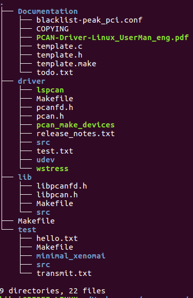
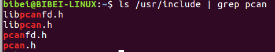

# Prerequisites
  PCAN-BASIC is a simple driver for pcan devices. The PcanChannel class use PCAN-BASIC library for reading, processing and writing Packet from can bus. Download and install instructions can be found at:
  [peak-linux-driver](http://www.peak-system.com/fileadmin/media/linux/files/peak-linux-driver-8.4.0.tar.gz)
  **and**
  [PCAN-Basic-Linux](http://www.peak-system.com/produktcd/Develop/PC%20interfaces/Linux/PCAN-Basic_API_for_Linux/PCAN_Basic_Linux-4.1.1.tar.gz)

  We have tested the library in **Ubuntu 16.14**.

# Install peak-linux-driver

  1. Open a termial, and type:
    ```sh
    sudo apt-get install libpopt-dev
    ```
  2. Download the peak-linux-driver. The result as folllow:
  <center>
  
  </center>
  3. Type the command in the terminal
  ```sh
  cd /path/to/peak_linux_driver
  make clean
  make
  sudo make install
  ```
  4. Verification. Type the command as follow, and you should end up with something similar to what I have below.
  ```sh
  ls /usr/include | grep pcan*
  ```
  <center>
  
  </center>

# Install pcan-basic
  1. Download the PCAN-Basic-Linux.
  2. Open a terminal, and type
  ```sh
  cd /path/to/PCAN_Basic_Linux/pcanbasic
  make
  sudo make install
  ```